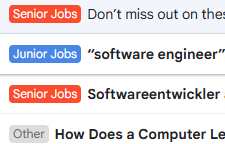

## Email labeler
Connects to an IMAP email server, retrieves recent emails, and uses chatgpt to categorize them based on predefined categories from appsettings.json. After categorization, it labels each email according to the selected category.



Add keys and categories in appsettings.json:
```
{
  "Settings": {
    "OpenAiApiKey": "",
    "OpenAiProjKey": "",
    "OpenAiOrgKey": "",
    "ImapAddress": "",    // gmail address
    "ImapPass": "",       // gmail app password
    "Categories": [
        {
          "Name": "Junior Jobs",
          "Description": "Work opportunities that include junior-level positions."
        },
        {
          "Name": "Senior Jobs",
          "Description": "Work opportunities without junior-level positions."
        },
        {
          "Name": "Job Responses",
          "Description": "Replies to job applications and interview invitations."
        },
        {
          "Name": "Other",
          "Description": "Emails unrelated to job opportunities."
        }
    ]
  }
}
```

